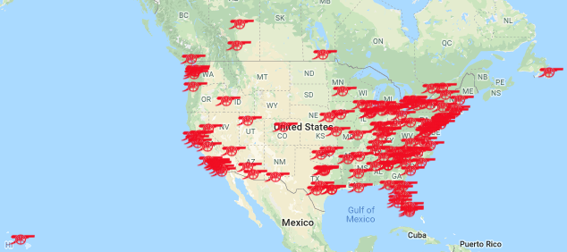

# Arsenal America Pub Scraper

[](https://github.com/psf/black)

This is the source code which can regularly scrape and export the official [Arsenal America Pubs page](http://www.arsenal.com/usa/news/features/arsenal-bars).

This data is used to populate this [Google My Maps Layer](https://drive.google.com/open?id=1lGiu2QTjyGmUcSdNN6EeZFiUXv6CL4NR&usp=sharing).


The icon used in the Maps layer can be found [here](http://getdrawings.com/arsenal-cannon-vector#arsenal-cannon-vector-37.png)

# About the Code
This program uses [Scrapy](https://www.github.com/scrapy/scrapy) to scrape and extract the list of official Arsenal America Pubs from the site.

Running this locally is simple from the project root:
```
scrapy crawl arsenal_america_pubs
```

Per Scrapy docs, an easy way to perform a test run and try out new functionality is to run this command from the project root:
```
scrapy shell http://www.arsenal.com/usa/news/features/arsenal-bars
```

Currently, this is only a scraper which extracts the data as a CSV. Future plans would include deployment somewhere so this could be regularly run on a schedule.
Ideally, we'd also be able to programatically update the [Google My Maps Layer](https://drive.google.com/open?id=1lGiu2QTjyGmUcSdNN6EeZFiUXv6CL4NR&usp=sharing). However, there currently is no API exposed for My Maps, so this may not be possible at this time.


# Notes / Known Issues
Unfortunately the [Arsenal America Pubs page](http://www.arsenal.com/usa/news/features/arsenal-bars) doesn't have a great DOM structure for reliably and easily extracting pub data.
Lacking the convenience of CSS classes pointing us to the DOM elements containing the data we care about, we're forced to do some validation to ensure we're pulling the correct `<p>` tags.
Currently, that's accomplished by ensuring we have a link to the pub's website, with the pub name as the text, as well as a phone number to the pub.
That decision does exclude one of the pubs which doesn't have a phone number on the page.
This is a known and [documented issue](https://www.github.com/matthewarmand/arsenal-america-pub-scraper/issues/1) in this repository.

